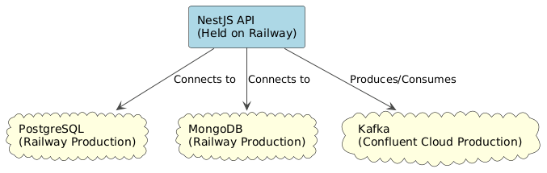
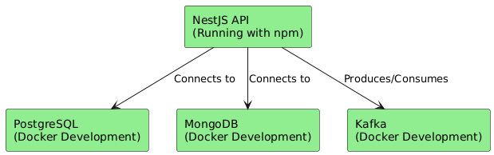

# About SUPMAP architecture

This document describes the architecture for the SUPMAP backend system. The architecture differs slightly between production and development environments.

## Overview

| Component      | Production                                 | Development                                           |
| -------------- | ------------------------------------------ | ----------------------------------------------------- |
| **API**        | Built with **NestJS** Hosted on Railway | Built with **NestJS** Running in Docker containers |
| **PostgreSQL** | Hosted on Railway                          | Runs in Docker                                        |
| **MongoDB**    | Hosted on Railway                          | Runs in Docker                                        |
| **Kafka**      | Provided by Confluent Cloud                | Runs in Docker                                        |

---

# Supmap - Systems architecture

---

## Production Architecture

---

## Development Architecture

---

# About our CI/CD

## Continuous integration for Pull Requests

| Step                | Description                                                |
| ------------------- | ---------------------------------------------------------- |
| Automatic Builds    | Every pull request triggers an automatic build.            |
| Testing             | Tests run automatically on your code.                      |
| Preview Deployments | Changes are deployed to a preview environment for testing. |

## Continuous deployment for Main Branch

| Step                 | Description                                                  |
| -------------------- | ------------------------------------------------------------ |
| Automatic Deployment | Merges into main trigger deployment to production.           |
| Low Downtime         | Techniques are in place to minimize downtime.                |
| Quick Rollback       | We can quickly revert to a previous version if issues occur. |
| Notifications        | The team gets notified of every deployment.                  |

---

# Security by design

We try to enforce security by design and ensure code quality to the highest standards
Here is a list of code quality and security measures that we implement in this project
| Measure | Description |
| ----------------------------------- | ------------------------------------------------------------------------- |
| **commitlint** | Enforces commit message standards to keep commits consistent. |
| **eslint** | Lints code to enforce coding standards and catch errors early. |
| **Precommit Type Safety** | Runs type checks before commits to catch type errors early. |
| **PR Template with Checks** | Provides guidelines and automated checks for pull requests. |
| **PR Reviews** | Peer reviews help catch issues and improve code quality. |
| **dependabot** | Monitors dependencies and updates them to avoid vulnerabilities. |
| **Notifications on Merge/Push** | Alerts the team about code changes to maintain awareness. |
| **Env Var Protection** | Secures environment variables from unauthorized access. |
| **Secure Secrets Manager (Proton)** | Manages and stores sensitive secrets securely. |
